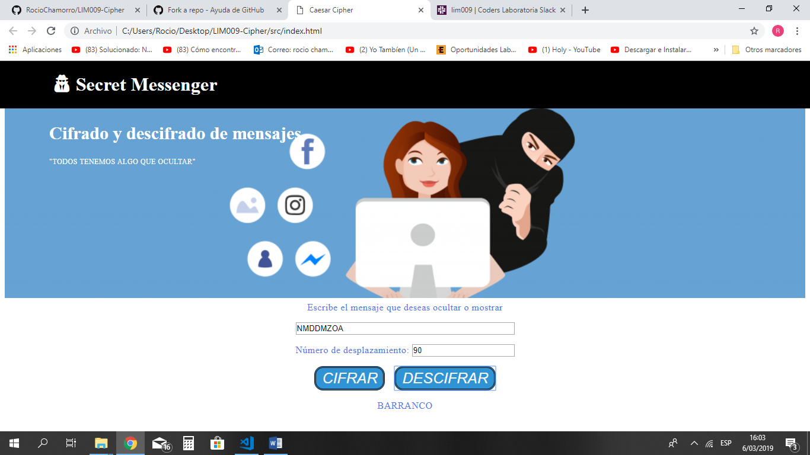

# Secret Messenger
Te ha sucedido que cuando quieres planificar un viaje, fiesta u otro tipo de evento con tus amigos necitas algo de privacidad para ciertas coordinaciones secretas, o cuando conversas con tu mejor amigo y quieres contarles cosas que solo él  pueda entender, sin correr el riesgo de que cualquier persona que revise tus redes sociales pueda leer tu conversación íntima ya que todos tenemos algo que ocultar, es por eso que creamos Secret Messenger para que te puedas expresar libremente con la seguridad de escribir en códigos tus mensajes que solo la persona de tu interés pueda entender descifrando tu mensaje. 

Este aplicativo web está dirigido para los jóvenes que utilizan redes sociales para comunicarse con sus amigos o familia con el objetivo de realizar coordinaciones secretas expresándose libremente sin temor que otros puedan entender sus mensajes logrando tener mayor privacidad en sus redes sociales.

## Funcionamiento
Para acceder a la página de *Secret Messenger* Utiliza el siguiente ling: <https://rociochamorro.github.io/LIM009-Cipher/src/index.html>.
En la primera ventana de la página se tiene que ingresar un secret name para identificarte.

Luego ingresa tu mensage que quieres cifrar o descifrar en el cuadro de texto. En esta imagen se muestra la palabra "BARRANCO" ingresada con un desplazamiento de 90 y como resultado obtenemos la palabra decifra: "NMDDMZOA"

En esta imagen se descifra la palabra obtenida anteriormente "NMDDMZOA" con el mismo número de desplazamiento de 90 y obtenemos como resultado: "BARRANCO"

## Recursos y temas relacionados

Video de Michelle que me ayudó a plantear la fórmula matemática del Cifrado César.

Diseño de experiencia de usuario (User Experience Design):

- Ideación
- Prototipado (sketching)
- Testeo e Iteración

Desarrollo Front-end:

* [Valores](https://lms.laboratoria.la/cohorts/lim-2019-02-bc-core-lim009/courses/javascript/01-basics/01-values-variables-and-types)
* [Tipos](https://lms.laboratoria.la/cohorts/lim-2019-02-bc-core-lim009/courses/javascript/01-basics/01-values-variables-and-types)
* [Variables](https://lms.laboratoria.la/cohorts/lim-2019-02-bc-core-lim009/courses/javascript/01-basics/02-variables)
* [Control de flujo](https://lms.laboratoria.la/cohorts/lim-2019-02-bc-core-lim009/courses/javascript/02-flow-control/00-opening)
* [Tests unitarios](https://lms.laboratoria.la/cohorts/lim-2019-02-bc-core-lim009/courses/javascript/11-testing/00-opening)
* [Aprende más sobre `charCodeAt()`](https://developer.mozilla.org/es/docs/Web/JavaScript/Referencia/Objetos_globales/String/charCodeAt)
* [Aprende más sobre `String.fromCharCode()`](https://developer.mozilla.org/es/docs/Web/JavaScript/Referencia/Objetos_globales/String/fromCharCode)
* [Aprende más sobre `ASCII`](http://conceptodefinicion.de/ascii/)
* [Documentación de NPM](https://docs.npmjs.com/)

Herramientas:

- [GitHub y GitHub Pages](https://guides.github.com/)
- [Guía de Scrum](https://www.scrumguides.org/docs/scrumguide/v1/scrum-guide-es.pdf): solamente para comenzar a entender cómo organizar tu trabajo.

## Checklist de la parte Obligatoria

* [x] `README.md` incluye info sobre proceso y decisiones de diseño.
* [x] `README.md` explica claramente quiénes son los usuarios y su relación con el producto.
* [x] `README.md` explica claramente cómo el producto soluciona los problemas/necesidades de los usuarios.
* [x] Usa VanillaJS.
* [x] No utiliza `this`.
* [x] Implementa `cipher.encode`.
* [x] Implementa `cipher.decode`.
* [x] Pasa linter con configuración provista.
* [x] Pasa pruebas unitarias.
* [x] Pruebas unitarias cubren 70% de _statements_, _functions_ y _lines_, y un
  mínimo del 50% de _branches_.
* [x] Interfaz permite elegir el `offset` o _desplazamiento_ a usar en el
  cifrado/descifrado.
* [x] Interfaz permite escribir un texto para ser cifrado.
* [x] Interfaz muestra el resultado del cifrado correctamente.
* [x] Interfaz permite escribir un texto para ser descifrado.
* [x] Interfaz muestra el resultado del descifrado correctamente.

Por el momento no se ha desarrollado la parte opcional: "Hacker edition" por motivo de tiempo, sin embargo se estará implementando posteriormente.